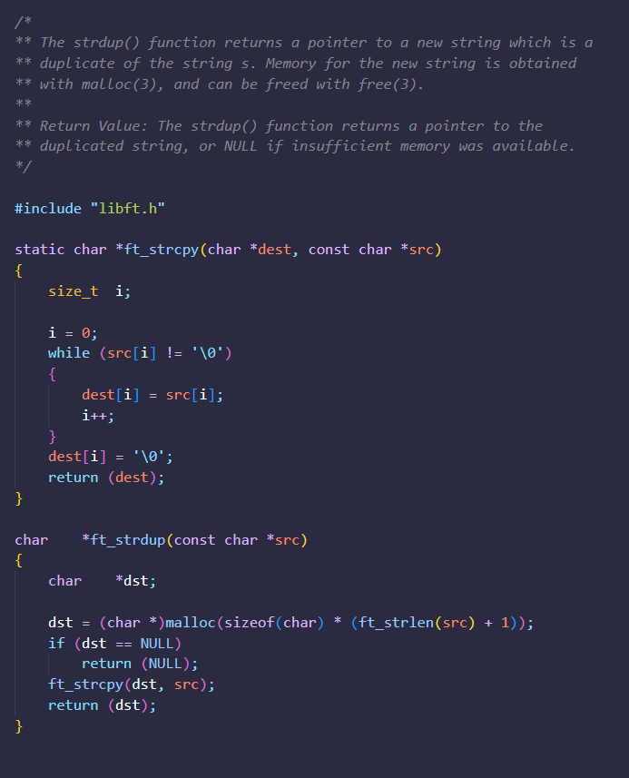

# Libft (Original Version)

Libft is the first project of the 42 school cursus.

The goal of this project: let us recreate a basic library of functions for the C language projects.

Making students recreate basic functions allows them to understand how basic functions are implemented and work, but they are also encouraged to create a toolbox library for their projects in C.

This toolbox will be updated over and over again during each student's cursus path according to their needs, and it is a great opportunity to challenge their logic and develop their problem-solving skills.